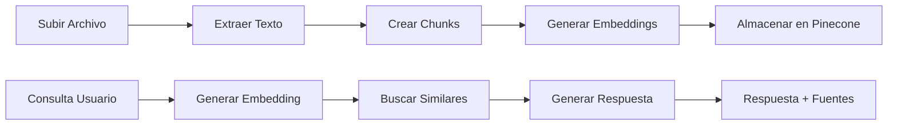

# 🤖 RAG System

Sistema de Recuperación Aumentada de Generación (RAG) construido con FastAPI, LangChain, OpenAI y Pinecone para procesamiento inteligente de documentos y respuesta a consultas.

## 📋 Descripción

Este sistema RAG permite:

- **Subir documentos** en múltiples formatos (PDF, DOCX, TXT, MD, CSV)
- **Procesar y vectorizar** contenido usando embeddings de OpenAI
- **Almacenar vectores** en base de datos Pinecone
- **Consultar documentos** con búsqueda semántica
- **Generar respuestas** contextualizadas usando LLM

## 🚀 Características

- ✅ **API REST** completa con FastAPI
- ✅ **Múltiples formatos** de archivo soportados
- ✅ **Procesamiento automático** de documentos a vectores
- ✅ **Búsqueda semántica** avanzada
- ✅ **Generación de respuestas** con contexto
- ✅ **Validaciones robustas** y manejo de errores
- ✅ **Tests unitarios** completos
- ✅ **Logging estructurado** para monitoreo

## 📁 Estructura del Proyecto

```
rag/
├── app/
│   ├── api/           # Rutas y endpoints
│   ├── core/          # Configuración y logging
│   ├── models/        # Modelos de datos
│   ├── schemas/       # Esquemas Pydantic
│   ├── services/      # Lógica de negocio
│   └── utils/         # Utilidades (extracción texto, vectorización)
├── tests/             # Tests unitarios
├── .env.example       # Variables de entorno template
└── pyproject.toml     # Dependencias y configuración
```

## 🛠️ Instalación

### Prerrequisitos

- **Python 3.13+**
- **uv** (recomendado) o pip
- **Cuentas API**: OpenAI y Pinecone

### 1. Clonar repositorio

```bash
git clone https://github.com/lupydev/rag.git
cd rag
```

### 2. Crear entorno virtual

```bash
# Con uv (recomendado)
uv venv
source .venv/bin/activate  # Linux/Mac
# .venv\Scripts\activate   # Windows

# O con Python estándar
python -m venv .venv
source .venv/bin/activate
```

### 3. Instalar dependencias

```bash
# Con uv
uv sync

# O con pip
pip install -e .
```

### 4. Configurar variables de entorno

```bash
cp .env.example .env
# Editar .env con tus claves API
```

Configura estas variables en `.env`:

```env
# OpenAI
OPENAI_API_KEY=sk-your-openai-key

# Pinecone
PINECONE_API_KEY=your-pinecone-key
PINECONE_INDEX_NAME=rag-index

# LangSmith
LANGSMITH_API_KEY=your_langsmith_api_key_here
```

## 🏃‍♂️ Uso

### Iniciar servidor

```bash

fastapi dev app/main.py
```

La API estará disponible en: http://localhost:8000

📖 **Documentación**: http://localhost:8000/docs

### Endpoints principales

| Método   | Endpoint                 | Descripción                 |
| -------- | ------------------------ | --------------------------- |
| `POST`   | `/api/documents/upload`  | Subir y procesar documento  |
| `POST`   | `/api/documents/query`   | Consultar documentos        |
| `DELETE` | `/api/documents/vectors` | Eliminar todos los vectores |

### Ejemplos de uso

#### 1. Subir documento

```bash
curl -X POST "http://localhost:8000/api/documents/upload" \
  -F "file=@document.pdf"
```

#### 2. Consultar documentos

```bash
curl -X POST "http://localhost:8000/api/documents/query" \
  -H "Content-Type: application/json" \
  -d '{
    "query": "¿Qué es machine learning?",
    "max_results": 5,
    "similarity_threshold": 0.7
  }'
```

## 🔧 Desarrollo

### Ejecutar tests

```bash
# Todos los tests
pytest

# Con coverage
uv run pytest --cov=app --cov-report=html

# Tests específicos
uv run pytest tests/test_services.py -v
```

### Linting y formateo

```bash
# Instalar herramientas de desarrollo
uv pip install ruff black

# Linting
ruff check app/ tests/

# Formateo
black app/ tests/
```

### Estructura de tests

- `tests/test_schemas.py` - Validación de modelos Pydantic
- `tests/test_services.py` - Lógica de negocio y servicios
- `tests/test_utils.py` - Utilidades (extracción texto, etc.)
- `tests/conftest.py` - Fixtures y configuración de tests

## 📊 Formatos de Archivo Soportados

| Formato  | Extensión | Descripción                                         |
| -------- | --------- | --------------------------------------------------- |
| PDF      | `.pdf`    | Documentos PDF con texto extraíble                  |
| Word     | `.docx`   | Documentos Microsoft Word                           |
| Texto    | `.txt`    | Archivos de texto plano                             |
| Markdown | `.md`     | Archivos Markdown                                   |
| CSV      | `.csv`    | Datos tabulares (convertidos a descripción textual) |

## 🏗️ Arquitectura

### Flujo de procesamiento



### Componentes principales

- **Text Extraction**: Convierte documentos a texto plano
- **Chunking**: Divide texto en fragmentos procesables
- **Embeddings**: Genera vectores semánticos con OpenAI
- **Vector Store**: Almacena y busca en Pinecone
- **LLM Integration**: Genera respuestas contextualizadas

## 📈 Monitoreo

El sistema incluye logging estructurado:

```python
# Logs disponibles en
app.log           # Aplicación general
server.log        # Servidor web
```

Niveles de log configurables: `DEBUG`, `INFO`, `WARNING`, `ERROR`

## 🔒 Seguridad

- ✅ Validación de tipos de archivo
- ✅ Límites de tamaño de archivo
- ✅ Sanitización de entrada
- ✅ Manejo seguro de errores
- ✅ Variables de entorno para secretos

## 📜 Licencia

Este proyecto está bajo la Licencia MIT. Ver `LICENSE` para más detalles.

## 🚀 Roadmap

- [ ] Soporte para más formatos (PPT, HTML)
- [ ] Interfaz web interactiva
- [ ] Cache de embeddings
- [ ] Métricas y analytics
- [ ] Deployment con Docker
- [ ] Autenticación y autorización
